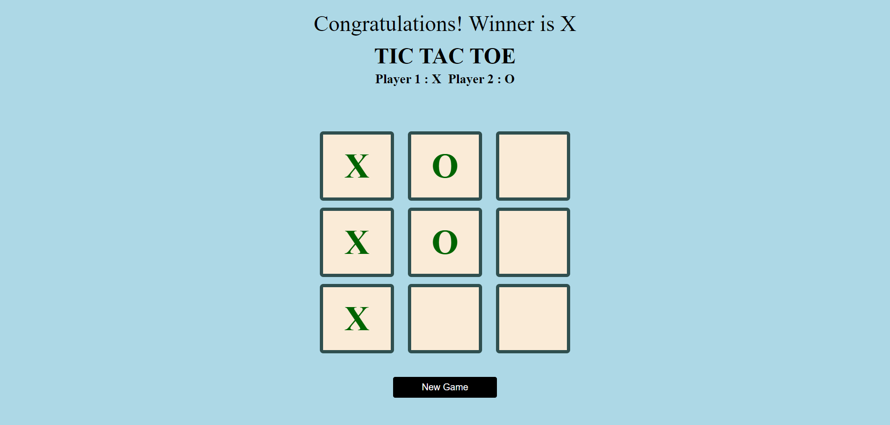

# Tic Tac Toe Game

Welcome to the Tic Tac Toe Game project! This project is a web-based implementation of the classic Tic Tac Toe game, created using HTML, CSS, and JavaScript. The primary goal of this project is to demonstrate and practice various concepts in these technologies.

## Table of Contents

- [Overview](#overview)
- [Features](#features)
- [Technologies Used](#technologies-used)
- [Usage](#usage)
- [Contact](#contact)

## Overview

This project is a fully functional Tic Tac Toe game that allows two players to play against each other on a 3x3 grid. The game includes features like detecting the winner, handling draws, and resetting the game. The implementation demonstrates the use of various HTML, CSS, and JavaScript concepts.

## Features

- Interactive 3x3 grid for playing Tic Tac Toe
- Detects and announces the winner or a draw
- Game reset functionality
- Responsive design for different screen sizes
- Clean and modern UI design

## Technologies Used

- **HTML5**: For the structure and content of the web page
- **CSS3**: For the styling and layout of the web page
- **JavaScript**: For the game logic and interactivity

## Usage

Open the `index.html` file in a web browser to start the game. Two players can take turns clicking on the grid cells to place their marks (X or O). The game will automatically detect and announce the winner or a draw. Use the reset button to start a new game.

---

Thank you for checking out my Tic Tac Toe Game project! I hope you find it useful for understanding various HTML, CSS, and JavaScript concepts.

### Contact

- **Name:** Muhammad Awais
- **GitHub:** [awaisarshad819](https://github.com/awaisarshad819)
- **Email:** [awaisarshad819@gmail.com](mailto:awaisarshad819@gmail.com)

Feel free to reach out if you have any questions or suggestions!

---

*Note: This project is for educational purposes only.*
